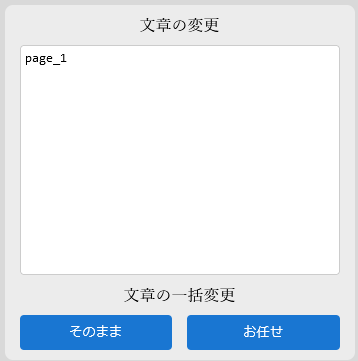

# Two Tomes(書物型)

## アプリゲーム「nieR Re[in]canation」に出てくるオトモを作成しました。
 - 2024年4月30日にサービスを終了しています。
 - 「書物型：血と贄」と「書物型：星と歌」の3Dビューワーを作成しました。
 - 二冊の本は共通の動きをします。どちらに触れても動作します。
 - テキストエリアに **英語** で入力してください。
 - 入力すると「血と贄(白色)」に英語が表示され、「星と歌(黒色)」にゲームで使われている天使文字が表示されます。
 - 営利目的で作成していません。

### このプロジェクトは次の目的で作っています。
1. 技術的アピールを行うため。
2. ファンとして応援したいため。二次創作として作成しています。

## サイト上部のアイコンについて

- マウスをかざすと機能が確認できます。
- 一番左のアイコンでコントロールパネルを表示します。他は試してみてください。

## コントロールパネルのテキストエリアについて
<div>
  
  <div>上記の画像の時のみ、文章の一括変更が可能です。</div>
  <div>それ以外は個別でページの文章の変更ができます。</div>
</div>

## Usage
始める前にDocker Desktopをインストールしてください。
1. コンテナの起動
```bash
$ docker compose up -d --build
$ docker compose exec twotomes /bin/bash
```
2. pnpmのインストール
```bash
$ cd app
$ pnpm install
```
3. ローカルで確認
```bash
$ pnpm dev --host
```